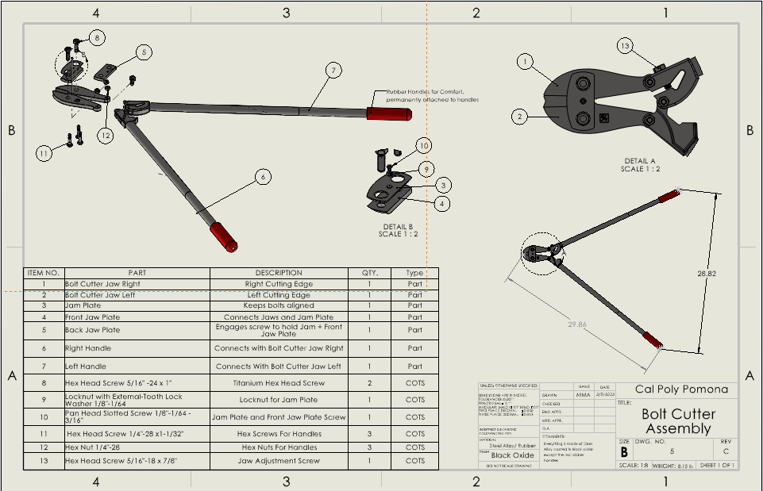
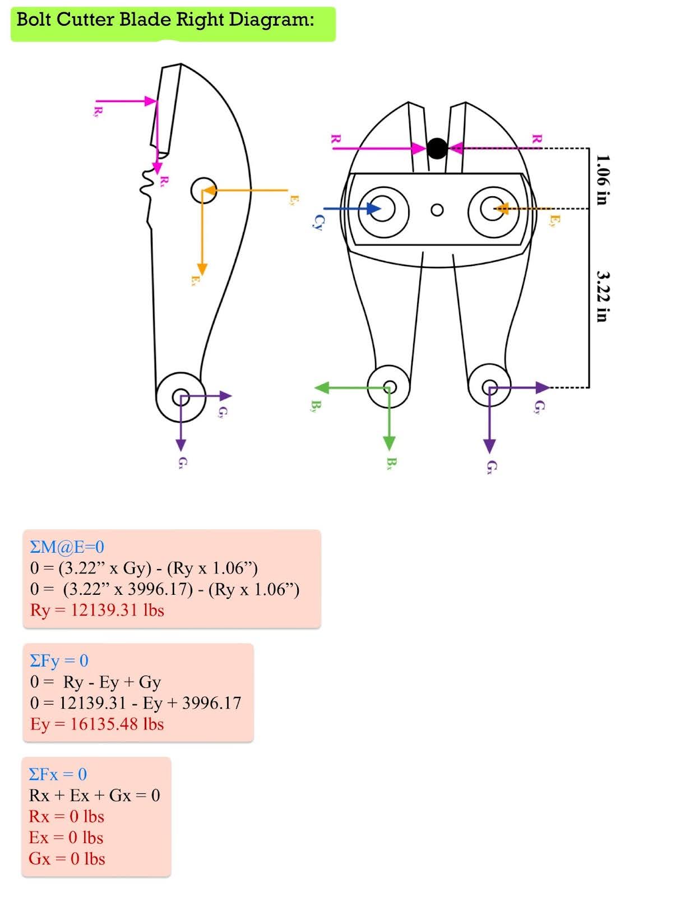

[Home](/) | [About](/about) | [Projects](/projects)

---

# Bolt Cutter Reverse Engineering

## Objective
Disassemble and analyze a mechanical tool to reverse engineer it into a CAD model and drawing package. Gain insight into part relationships, mechanisms, and manufacturability

## Outcomes & Contributions
- Disassembled bolt cutters and documented all parts with Calipers, rulers, and other measuring tools.- Contributed to machine frame and axis system
- Created detailed CAD models of each component using SolidWorks
- Generated an assembly model and a full set of engineering drawings
- Analyzed material selections for each part
- Performed hand-calculated static analysis for each part

## Technical Details & Skills
- Reverse engineering methodology
- Mechanical linkage understanding and 2D sketch replication
- SolidWorks part modeling and mechanical assembly
- Technical drawing development and dimensioning

## Results
The completed CAD model accurately represented the bolt cutters’ operation, including their compound leverage mechanism. The report provided a clear understanding of the reverse engineering process and detailed insights into the tool’s design and functionality. The project reinforced key concepts in mechanical design and assembly alignment.

## Media
| Bolt Cutters Drawing & BOM (Exploded View) |
|--------------------------------------------|
|  |

| Static Analysis (Jaws) | Static Analysis (Handle) |
|--------------|-------------------|
|| | 

