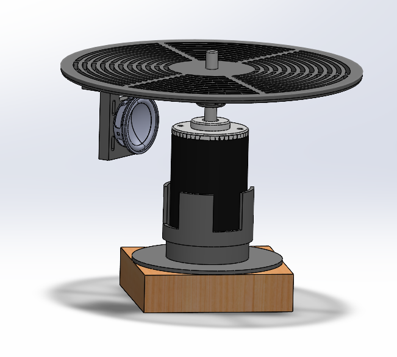
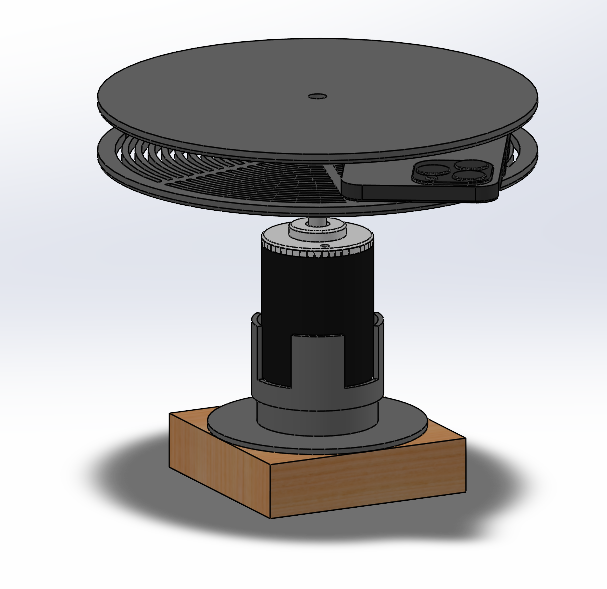
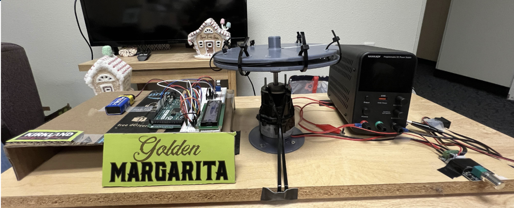

[Home](/) | [About](/about) | [Projects](/projects)

---

# Doppler Project

## Objective
Conduct a lab experiment to demonstrate and analyze the Doppler Effect using controlled sound wave experiments and computational methods

## Outcomes & Contributions
- Set up an experiment setup involving a revolving sound source via a speaker and a stationary microphone
- Designed and 3D printed housing for sensors, then produced detailed drawings using SolidWorks
- Collected and analyzed frequency shift data to quantify the Doppler Effect
- Developed and utilized an Arduino code using IDE to control the motor, microphone, and speaker
- Documented findings in a formal lab presentation

## Technical Details & Skills
- Basic acoustic theory and wave behavior
- Experimental setup design and execution
- Data collection and frequency analysis
- Technical communication via PowerPoint and written reporting

## Results
The demonstration effectively showcased the real-world application of the Doppler Effect and was well-received by peers and instructors. The slide deck supported the live demonstration with visuals and theoretical background, reinforcing comprehension of the phenomenon.

## Media
| CAD Model Rev A | CAD Model Rev B|
|-----------------|----------------|
|  |  |

| Physical Assembly |
|-------------------|

