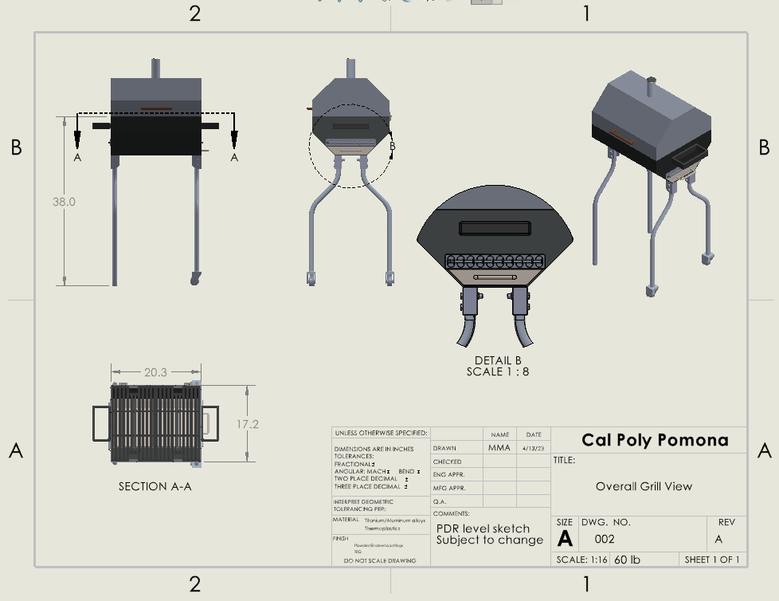
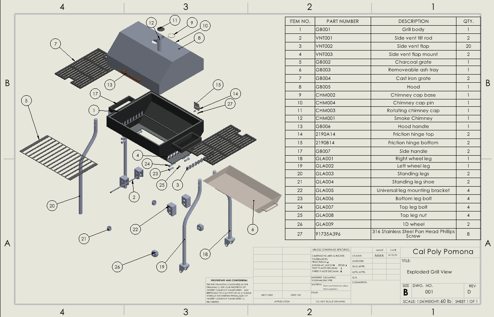

[Home](/) | [About](/about.md) | [Projects](/projects.md) 

---

# Design of Industrial Barbeque Grill

## Objective
Design a robust, mobile grill system tailored for large outdoor gatherings and commercial-scale cooking. The project focused on meeting specified requirements such as weight limits, portability, and modular design, while ensuring functional and practical features

## Outcomes & Contributions
- Designed key grill components, including the base frame, grill racks, and side attachments
- Created detailed SolidWorks models and associated technical drawings that can facilitate commercializing prototyping
- Presented Preliminary Design Review to faculty and peers and received outstanding review

## Technical Details & Skills
- Mechanical CAD modeling and drawing generation using SolidWorks
- Engineering documentation and technical presentation

## Results
The final design package included complete SolidWorks assemblies, detailed part drawings, and a bill of materials. While a physical prototype was not constructed, the grill design was well-received for its practicality, mobility features, and attention to structural detail. The project demonstrated a clear understanding of mechanical design and human factor, and product development workflows.

## Media

Industrial Barbeque Grill Drawing

Industrial Barbeque Grill Drawing (Exploded View & BOM)
