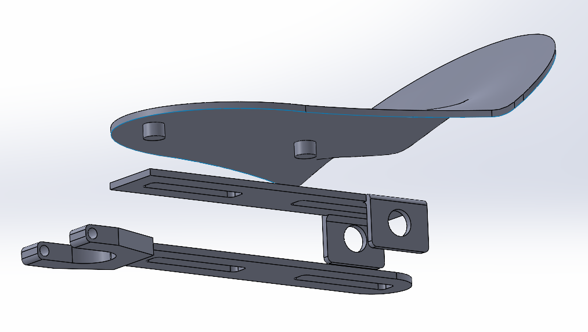
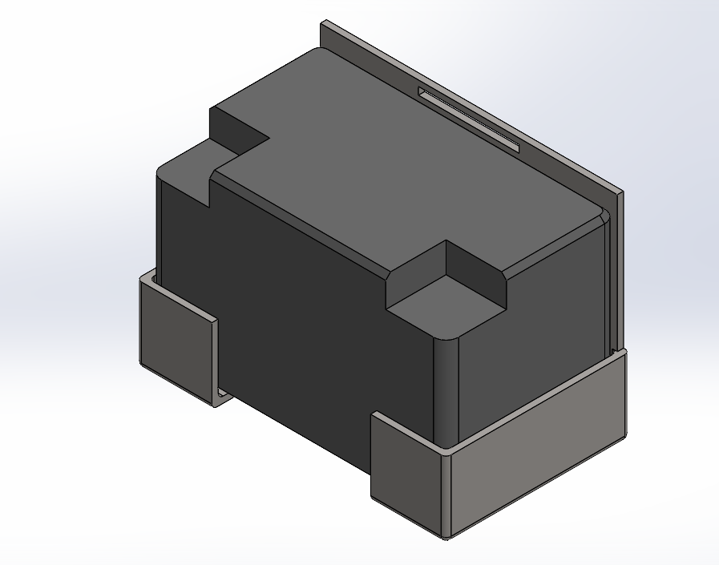
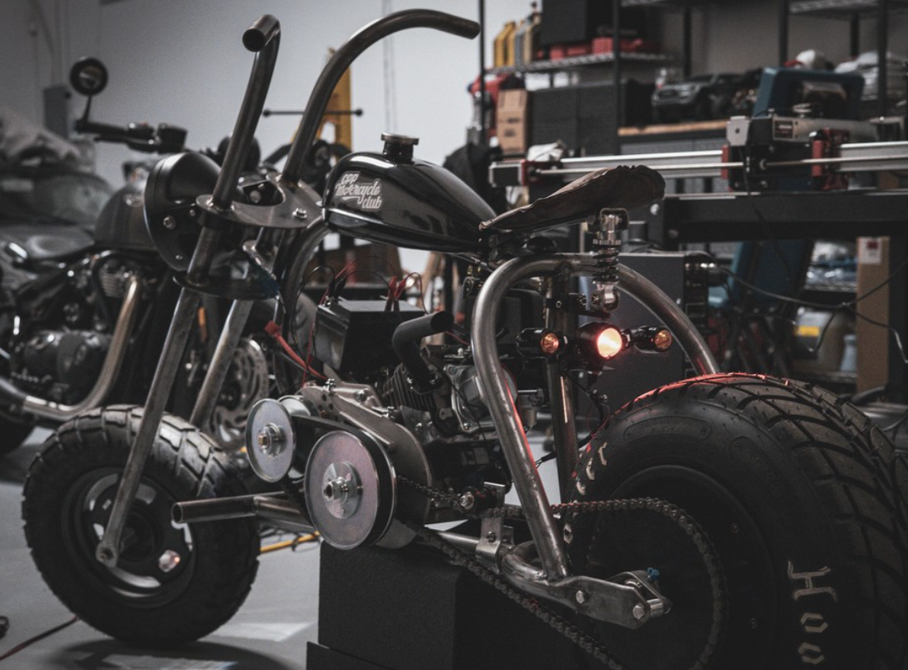

[Home](/) | [About](/about) | [Projects](/projects)

---

# Mini Chopper Motorcycle

## Objective
Design and fabricate key mechanical subsystems for a miniature chopper motorcycle, focusing on ergonomic seat design, load-bearing functionality, and battery housing integration. The project emphasized structural performance, manufacturability, and rider comfort through iterative design.

## Outcomes & Contributions
- Designed and prototyped a seat pan fitted to the frame’s main bracket within an 8×10-inch constraint
- Modeled and validated geometry in SolidWorks using 3D-printed ABS prototypes
- Developed a spring hinge to reduce seat deflection and improve comfort
- Designed a battery mount for stable and accessible integration with the frame

## Technical Details & Skills
- SolidWorks modeling, assembly design, and fabrication documentation
- Rapid prototyping using 3D printing for geometry verification and fit testing
- Collaboration in a multidisciplinary team environment for concept testing and manufacturing readiness

## Results
The final assembly achieved structural integrity and ergonomic balance through iterative refinement. The spring hinge effectively absorbed dynamic loads, and the seat pan met comfort and dimensional goals. The battery mount successfully completed the electrical subsystem housing, contributing to overall system functionality. The project demonstrated practical integration of 3D design, fabrication, and mechanical testing within a small-scale motorcycle platform.

## Media
| Seat Pan & Spring Hinge Assembly | Battery Mount Assembly |
|----------------------------------|------------------------|
|  |  |

| Physical Assembly |
|-------------------|

