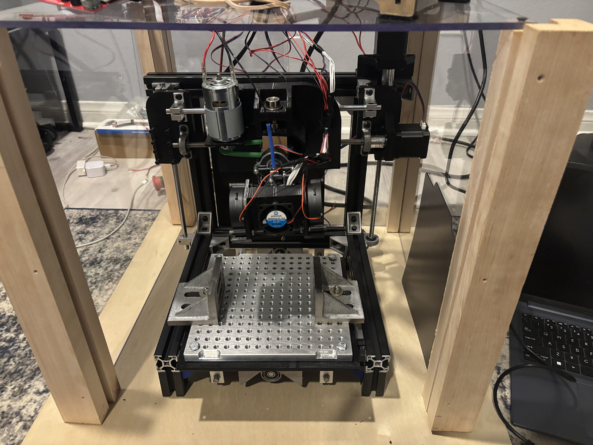
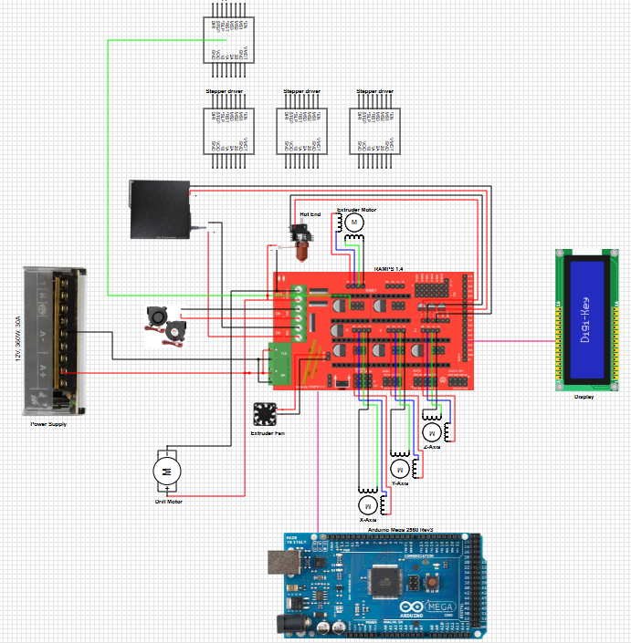

[Home](/) | [About](/about) | [Projects](/projects)

---

# Mini Maker Mill

## Objective
Design and develop a hybrid manufacturing system capable of CNC milling and 3D printing using a dual-head machine on a single axis. Provide users with a compact and affordable fabrication solution by combining additive and subtractive manufacturing processes in one platform.

## Outcomes & Contributions
- Designed the dual-head assembly using SolidWorks, incorporating a CNC spindle and a 3D printer hotend
- Contributed to machine frame and axis system
- Conducted SolidWorks FEA to validate 3D printed parts
- Supported subsystem integration and testing

## Technical Details & Skills
- SolidWorks CAD and assemblies
- Structural frame design and motion system layout
- G-code processing and Arduino integration
- Multi-functional machine development

## Results
Demonstrated rotational switching between heads and basic motion control while meeting footprint and strength constraints.

## Media
| CAD Modeled Assembly | Physical Assembly |
|----------------------|-------------------|
|  |  |

| Electrical Schematic |
|---|
|  |
