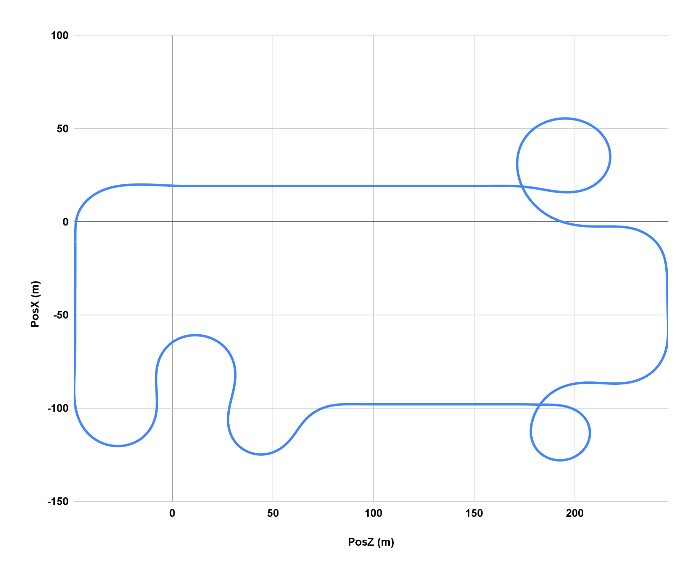
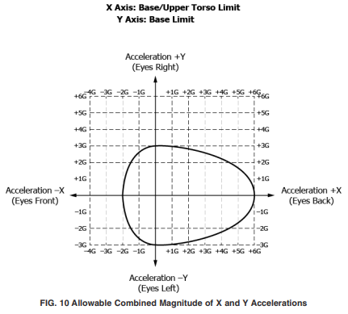
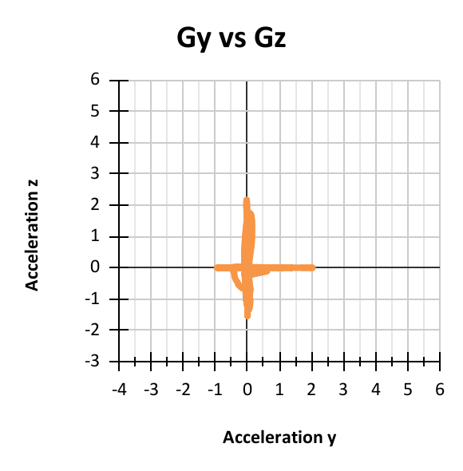
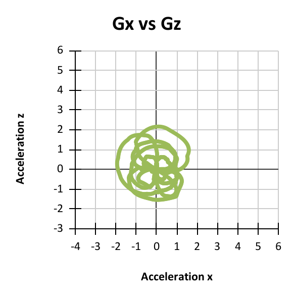
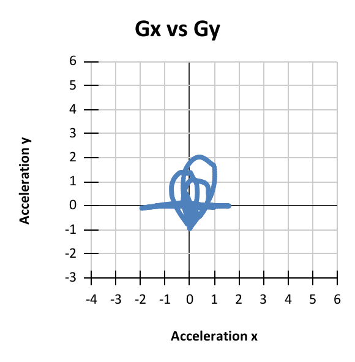

[Home](/) | [About](/about.md) | [Projects](/projects.md) 

---

# Roller Coaster Design

## Objective
To design an immersive, Minecraft-themed roller coaster incorporating mechanical safety, environmental effects, and interactive VR screens. The ride aimed to meet ASTM amusement safety standards while delivering a thrilling and memorable user experience.

## Outcomes & Contributions
- Created a full ride layout with realistic biome transitions, a dynamic storyline, and portal based ride sequences
- Performed calculations on ride forces, braking distances, and deflection under loading conditions
- Contributed to mechanical subsystem development including chain-lift drive, anti-rollback mechanisms, and emergency brakes 
- Participated in VR and environmental effect integration to enhance user immersion
- Presented project during conceptual, intermediate, and final design reviews

## Technical Details & Skills
- Applied design criteria from ASTM F2291 to ensure structural and rider safety
- Modeled ride dynamics and structural stresses using analytical equations and simulation principles
- Developed restraint systems using patent references and FOS calculations
- Conducted buckling and fatigue checks for support columns using Euler-Johnson methodology
- Designed emergency braking zones and overhang clearance with envelope analysis

## Results
Delivered a comprehensive engineering plan for a 1.75-minute ride spanning 1156.5 meters with four trains. Validated mechanical systems (chain lift, support structure, restraints, braking) against worst-case loads. The project merged storytelling, VR integration, and mechanical safety into a professional grade concept suitable for theme park applications

## Media
  

|            |Acceleration Safety Charts |             |
|--------------|-------------------|-------------------|
| |  |  | 
| |  |  | 
